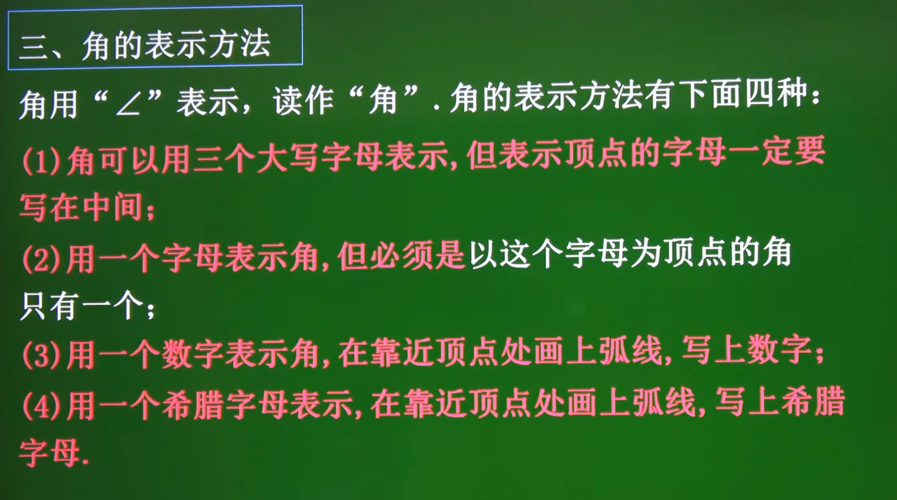
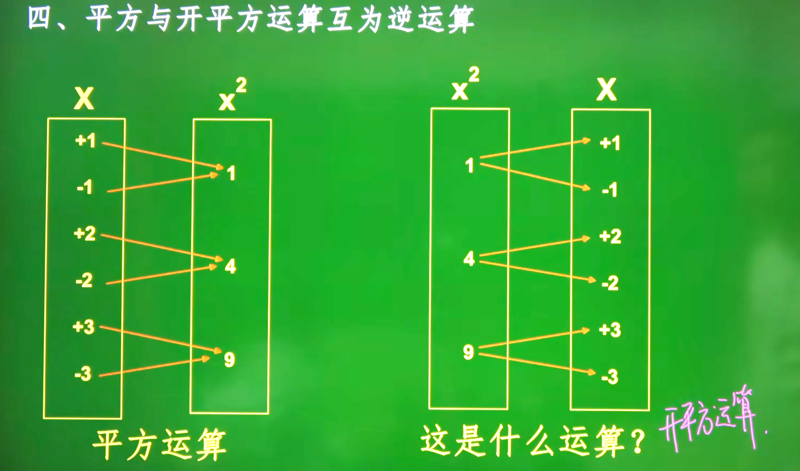
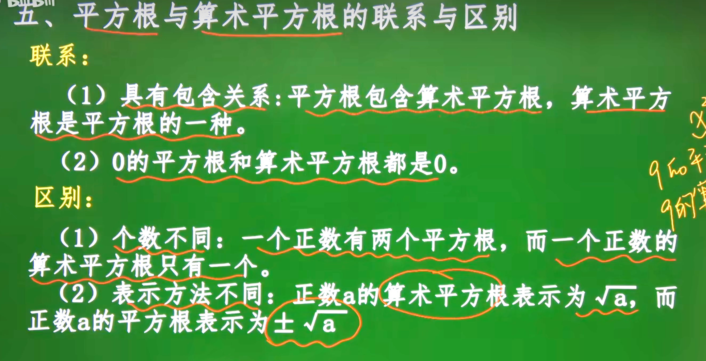
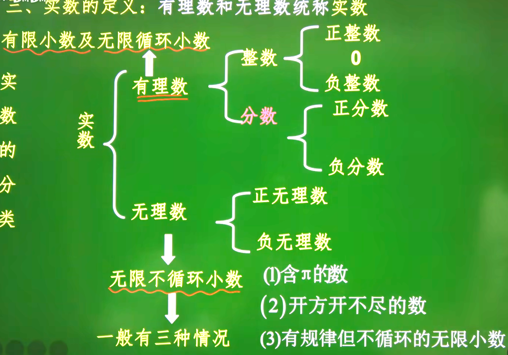

[TOC]

# 正数和负数

## 正数和负数的理解

> 数字前面的符号是`+`的为正数`-`的为负数
>
> ==注意：零既不是正数也不是负数==

# 有理数

## 有理数的定义和理解

> 有理数的概念：整数和分数统称为有理数

### 有理数的分类

1. 整数
   + 正整数
   + 零
   + 负整数
2. 分数
   + 正分数
   + 负分数

## 有理数的加法法则

> 1. 同号两数相加，取相同的符号，并把绝对值相加
> 2. 异号两数相加时；
>    + 若绝对值不相等，取绝对值较大的数的符号，并用较大的的绝对值减去较小的绝对值
>    + 若绝对值相等，和为零，也就是互为相反数的两个数相加得0

## 有理系数的减法法则

> 1. 减去一个数 ，等于加上这个数的相反数也可以表示成: $a - b = a + (-b)$ 
>
> 规律：数字前“$-$” 号是奇数个取“$-$”， 数字前“$-$”号是偶数个取“$+$”.    

## 有理数的乘法法则

> 1. 两数相乘，同号得正，异号得负，并把绝对值相乘，任何数同零相乘，都得零。
>
> 有理数乘积的符号结论：几个不等于0的因数相乘，积的符号由负因数的个数决定，当负因数有奇数个时，积的符号为负，当负因数有偶数个时，积的符号为正，只要有一个因数为0，积就为0.

## 有理数乘法的运算规律

> 1. 乘法交换律：$ab=ba$ , 两个数相乘，交换因数的位置，积相等
> 2. 乘法结合律：$(ab)c=a(bc)$ ，三个数相乘，先把前两个数相乘，或者先把后两个数相乘，积相等
> 3. 乘法分配律：$a(b+c)=ab+ac$ ，一个数同两个数的和相乘，等于把这个数分别同这两个数相乘，再把积相加。

## 有理数的除法法则

> 1. 除以一个不等于0的数，等于乘以这个数的倒数
>
>    $a\div b=a\cdot \cfrac{1}{b}(b\neq0)$
>
> 2. 两数相除，同号得正，异号得负，并把绝对值相除，0除以任何一个不等于0的数，都得0.

### 倒数的概念

> 除以一个数等于乘以这个数的倒数
>
> 注意：求小数的倒数时，要先把小数化成分数，求带分数的倒数时，要先把带分数化成假分数 

## 乘方

> 注意：表示负数的乘方，书写时一定要把整个负数（连同符号）用括号括起来，$-2^3 \neq (-2)^3$
>
> 规律：负数的奇数次幂是负数，负数的偶次幂是正数，正数的任何次幂都是正数，0的任何正整数次幂都是0.
>
> 总结：
>
> 1. 1的任何次幂都是1
> 2. -1的幂很有规律
>    + -1的奇数次幂是-1
>    + -1的偶次幂是1

## 有理数的运算顺序

> 1. 先乘方，再乘除，最后加减
> 2. 如有括号，先做括号内的运算，按小括号，中括号，大括号依次进行

## 科学计数法

> 科学计数法：把一个10的数表示成$a\times10^n$的形式（其中大于或等于1且小雨10，n是正整数）使用的是科学计数法。
>
> 例子：
>
> $2,600,000=2.6\times1,000,000=2.6\times10^6$
>
> $300,300=3\times100,000=3\times10^5$
>
> $57,600,000 = 5.76\times10,000,000=5.76\times10^7$ 

## 整式

### 单项式的概念

> 单项式是代数中的一个基本概念，它指的是只有一个项的代数表达式。一个单项式可以是一个常数，一个变量的幂，或者是两者的乘积。单项式的几个关键特点包括：
>
> 1. **常数系数**：单项式可以有一个系数，通常是一个实数。
> 2. **变量**：单项式可以包含一个或多个变量。
> 3. **指数**：每个变量可以有一个指数，通常是一个非负整数。
>
> 他们都是数或字母的积，像这样的式子叫做单项式。
>
> 单独的一个数或一个字母也是单项式
>
> 如下：
>
> $2.5x $ 、$-n$ 、$vt$、$-3x^2y3$
>
> 一个单项式中，所有字母的指数的和叫做这个单项式的次数
>
> 如下：
>
> $-3x^2y3$
>
> $-3$是系数,$x^2y^3=2+3$, $2 + 3 = 5$，五次
>
> ==注意：单项式的系数要包括起前面的括号，单项式的次数是所有字母的指数的和==

### 多项式的概念

> 多项式是数学中由多个单项式（代数术语中的“项”）通过加法或减法组合而成的表达式。每个单项式由系数、变量以及变量的非负整数次幂组成。多项式的一般形式可以写作：
>
> $a_nx^n+a_{n-1}x^{n-1}+...+a_2x^2+a_1x+a_0$
>
> + $x$是变量
> + $a_n,a_{n-1},...,a_1,a_0$是系数，可以是任何实数
> + $n$是最高次幂的指数，称为多项式的度数
>
> 例如，$3x^2+2x+1$是一个二次多项式，因为它的最高次幂是2
>
> **多项式的特点：**
>
> 1. **度数**：多项式的度数是他的最高次项的次数，在上面的例子中，多项式的度数是2.
> 2. **项：**多项式有一系列的项组成，每个项是一个单项式，在多项式$3x^2+2x+1$中，有三个项：$3x^2,2x$和常熟项$1$
> 3. **系数：** 项前的数字称为系数，在$3x^2+2x+1$中，3和2都是系数
> 4. **常数项：**没有变量（字母）的项称为常数项，如上列中的1.
>
> 多项式可以有一个变量（如上面的例子），也可以有多个变量（如$3x^2y+2xy^2+y+1$）。

## 整式的加减

### 同类项的概念

> 像$3ab^2$与$-4ab^2$这样，所含字母相同，并且相同字母的指数也相同的项叫做同类项。几个常数项也是同类项
>
> **判断同类项：**字母相同，相同字母的指数也相同，与系数无关与，字母顺序无关

#### 合并同类项

> 定义：把多项式种的同类项合并成一项
>
> 法则：
>
> 1. 系数：系数相加
> 2. 字母：字母和字母的指数不变

#### 去括号法则

> 如果括号外的因数是正数，去括号后原括号内各项的符号与原来的符号相同，如果括号外的因数是负数，去括号原括号内各项符号与原来的符号相反。
>
> 例如：$a+(b+c)=a+b+c$, $a-(b+c)=a-b-c$.
>
> 总结：“负”变，“正”不变.

## 一元一次方程

### 方程的概念

> 只要包含未知数的等式都是方程

### 一元一次方程的定义

> 只含有一个未知数（元），未知数的次数都是1，这样的方程都叫一元一次方程
>
> 一元一次方程的一般形式：$ax+b=0 (a\neq0)$

## 等式的性质

> 等式的性质1： 等式的两边加（或减）同一个数（或式子），结果仍相等
>
> 如果$a=b$，那么$a\pm c=b\pm c$
>
> 等式的性质2：等式两边乘同一个数，或除以同一个不为0的数，结果仍相等
>
> ​	如果$a=b$，那么$ac=bc$
>
> ​	如果$a=b(c\neq 0)$，那么$\frac{a}{c} = \frac{b}{c} $
>
> **注意：**
>
> 1. 等式两边都要参加运算，并且是作同一种运算
> 2. 等式两边加或减，乘或除以的数一定是同一个数或同一个式子。
> 3. 等式两边不能都除以0，即0不能做除数或分母

## 角的概念

> 角是由具有公共端点的两条射线组成的图形
>
> 角也可以看作是一条射线围绕着他的端点旋转而形成的图形

## 平角的和周角的定义

> 一条射线围绕它的端点旋转，当终边和始边成一条直线时，所成的角叫做平角，终边·继续旋转，当它又和始边重合时，所成的角叫做周角

## 角的表示方法

> 

## 平行线

### 平行线的判定

> 1. 同位角相等，两直线平行
> 2. 内错角相等，两直线平行
> 3. 同旁内角互补，两直线平行
> 4. 在同一平面内，垂直于同一直线的两直线平行
## 平分线

> 角的平分线就是某个角的一半

## 补角

> 两个角的和等于180°（平角），就说这两个角互为补角，简称其中一个角是另一个角的补角。
>
> **几何语言表示为:**
> 	如果 $\angle 1+\angle 2=180^{\circ}$, 那么 $\angle 1$ 与 $\angle 2$ 互为补角.
>
> $\angle 1=180^{\circ}-\angle 2$

### 补角的性质

> 同角（等角）的补角相等

## 余角

> 两个角的和等于90°（直角），就说这两个角互为余角，简称互余，即其中一个角是另一个角的余角
>
> $\angle 1+\angle 2 = 90^{\circ}$
>
> **几何语言表示为:**
> 	如果 $\angle 1+\angle 2=90^{\circ}$, 那么 $\angle 1$ 与 $\angle 2$ 互为余角.

### 余角的性质

> 同角（等角）的余角相等

## 算术平方根

### 算术平方根的定义

> 一般的，如果一个正数x的平方等于a，即 $x^2=a$，那么这个正数$x$叫做$a$的算术平方根，啊的算术平方根记为$$\sqrt{a}$$ ，读作“根号a”，$a$叫做被开方数。 
>
> $$即: x^2 = a(x > 0), x 叫做a 的算术平方根,记作: x = \sqrt{a}$$
>
> $$\text{规定:0的算术平方根是0。}$$
>
> $$\text{记作:}\sqrt{0}=0$$
>
> **总结：** 也就是说，非负数的“算术平方根”走从数。 负数不存在算术平方根，即当$a<0$时，$\sqrt{a}$
>
> O
>
> $$\textbf{如:}\sqrt{-6}\textbf{ 无意义; 8是64的算术平方根或 }\sqrt{64}=8$$
>
> 

# 平方根

## 平方根的定义

> $$一般的,如果一个数X的平方等于a,即x^2=a那么这$$$$\text{个数X叫做a的平方根(也叫做二次方根)。}$$
>
> 求一个数a的平方根的运算，叫做开平方， 其中a叫做被开方数 
>
>  例如，因为3和-3的平方都等于9，我们就说3和-3是9的平方根也可以说：9的平方根是士3.
>
> 
>
> 

# 立方根

## 立方根的定义

> $$\text{一般地,一个数的立方等于a,这个数就叫做a的立方根, }$$ $$\textbf{也叫做a的三次方根. 记作}\sqrt[3]{a}\cdot $$

# 实数

 
